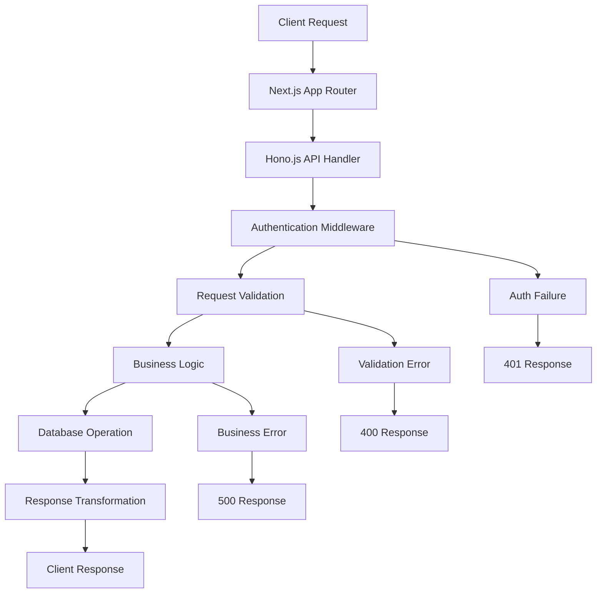
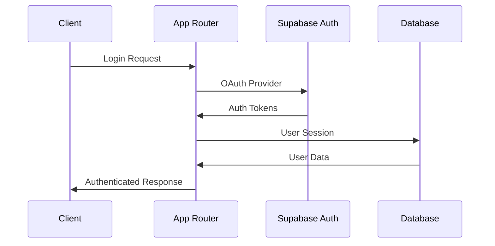
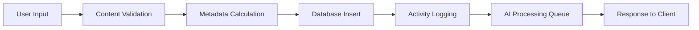
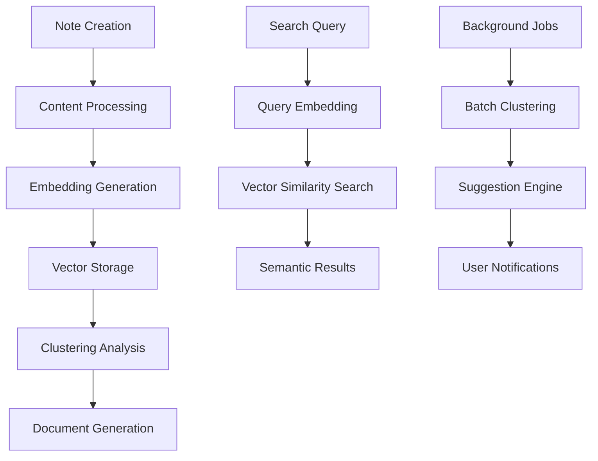

# Context AI Note-Taking Application: Architecture Report

## Executive Summary

Context is a sophisticated AI-powered note-taking application designed around Andrej Karpathy's "append-and-review" methodology. The system employs a unified Next.js 15 + Hono.js architecture that delivers fast note capture with intelligent clustering and document generation capabilities. This report provides a comprehensive analysis of the system's technical architecture, identifying strengths, potential risks, and strategic recommendations for future development.

### Key Findings

- **Unified Architecture**: Successfully implements a single-codebase approach combining frontend and backend functionality
- **Strong Type Safety**: Comprehensive TypeScript implementation with Zod validation ensures data integrity
- **Modern Stack**: Leverages cutting-edge technologies including Next.js 15, React 19, and PostgreSQL with pgvector
- **AI-Ready Infrastructure**: Feature-flagged AI capabilities with proper service abstraction
- **Production-Ready Monitoring**: Integrated Sentry error tracking and Vercel Analytics

### Critical Recommendations

1. **Implement comprehensive testing strategy** - Critical gap in current architecture
2. **Complete AI pipeline development** - Core differentiating features are behind feature flags
3. **Enhance security framework** - Add rate limiting and advanced input validation
4. **Optimize database performance** - Implement proper indexing and query optimization
5. **Develop caching strategy** - Reduce API response times and database load

---

## System Overview

### Architecture Philosophy

Context employs a **unified full-stack architecture** that eliminates the complexity of separate frontend and backend deployments. This approach provides several benefits:

- **Single Deployment Target**: Simplified CI/CD and reduced operational overhead
- **Shared Type System**: TypeScript types are consistent across all layers
- **Unified Error Handling**: Centralized error management and logging
- **Simplified State Management**: Direct API communication without additional abstraction layers

### Technology Stack

| Layer              | Technology    | Version | Purpose                                   |
| ------------------ | ------------- | ------- | ----------------------------------------- |
| **Frontend**       | Next.js       | 15.4.6  | React framework with App Router           |
| **Backend API**    | Hono.js       | ^4.9.0  | Lightweight web framework for API routes  |
| **Database**       | PostgreSQL    | Latest  | Primary data store with Supabase          |
| **Vector Store**   | pgvector      | Latest  | Semantic search capabilities              |
| **Authentication** | Supabase Auth | ^2.54.0 | User authentication and authorization     |
| **UI Framework**   | shadcn/ui     | Latest  | React component library                   |
| **Type Safety**    | TypeScript    | ^5      | Static type checking                      |
| **Validation**     | Zod           | ^4.0.17 | Runtime schema validation                 |
| **Monitoring**     | Sentry        | ^10     | Error tracking and performance monitoring |

---

## Technical Architecture Analysis

### 1. API Architecture

#### Unified API Pattern

```typescript
// Single entry point for all API routes
;/app/aip / [...route] / route.ts

// Hono.js app with mounted routers
const app = new Hono().basePath('/api')
app.route('/notes', notesRouter)
app.route('/clusters', clustersRouter) // Planned
app.route('/documents', documentsRouter) // Planned
```

**Strengths:**

- Centralized request handling and middleware
- Consistent error response format
- Built-in health check endpoint
- Type-safe request/response handling

**Potential Issues:**

- Single point of failure for all API operations
- Limited route-level customization
- Potential for increased bundle size

#### API Response Structure

```typescript
interface ApiResponse<T = unknown> {
  success: boolean
  data?: T
  error?: string
  message?: string
  timestamp: string
}
```

### 2. Database Architecture

#### Prisma Schema Design

The database schema demonstrates sophisticated design patterns:

```sql
-- Core entities with proper relationships
model User {
  id String @id @default(dbgenerated("uuid_generate_v4()"))
  // Relations to notes, clusters, documents
  notes Note[]
  clusters Cluster[]
  documents Document[]
}

model Note {
  id String @id
  content String
  embedding Unsupported("vector(1536)")? // pgvector integration
  metadata Json // Flexible metadata storage
}
```

**Advanced Features:**

- **pgvector Extension**: Native vector storage for semantic search
- **JSONB Metadata**: Flexible schema evolution without migrations
- **Soft Delete Pattern**: Data recovery capabilities
- **Comprehensive Indexing**: Optimized query performance
- **Row-Level Security**: Supabase RLS integration

#### Database Performance Considerations

```typescript
// Optimized indexes for common query patterns
@@index([userId, createdAt(sort: Desc)], name: "idx_notes_user_created")
@@index([clusterId], name: "idx_notes_cluster")
@@index([updatedAt(sort: Desc)], name: "idx_notes_updated")
```

### 3. Authentication Framework

#### Supabase Auth Integration

```typescript
// Environment-validated auth configuration
export const auth = {
  url: env.NEXTAUTH_URL,
  secret: env.NEXTAUTH_SECRET,
  providers: {
    google: services.hasGoogle
      ? {
          /* config */
        }
      : null,
    github: services.hasGitHub
      ? {
          /* config */
        }
      : null,
  },
}
```

**Security Features:**

- OAuth provider integration (Google, GitHub)
- JWT token validation
- Row-Level Security (RLS) policies
- Session management with Supabase
- Middleware-based route protection

### 4. Type Safety Implementation

#### Comprehensive Type System

```typescript
// Shared types across frontend and backend
export interface Note {
  id: string
  content: string
  userId: string
  clusterId?: string
  createdAt: Date
  updatedAt: Date
  metadata: NoteMetadata
}

// Runtime validation with Zod
const CreateNoteSchema = z.object({
  content: z.string().min(1).max(10000),
  metadata: z
    .object({
      tags: z.array(z.string()).optional(),
    })
    .optional(),
})
```

**Benefits:**

- Compile-time error detection
- Runtime validation and sanitization
- Automatic API documentation generation
- IDE autocomplete and refactoring support

### 5. Feature Flag System

#### Environment-Driven Configuration

```typescript
// Feature flags for AI capabilities
export const features = {
  aiClustering: env.ENABLE_AI_CLUSTERING,
  documentGeneration: env.ENABLE_DOCUMENT_GENERATION,
  semanticSearch: env.ENABLE_SEMANTIC_SEARCH,
  realTimeSync: env.ENABLE_REAL_TIME_SYNC,
} as const

// Service availability validation
export function validateRequiredServices() {
  // Comprehensive environment validation
  // Graceful degradation for missing services
}
```

---

## Data Flow and Integration Patterns

### 1. Request Processing Flow



### 2. Authentication Flow



### 3. Note Creation Flow



---

## Security and Authentication Framework

### 1. Authentication Mechanisms

#### Multi-Provider OAuth

- **Google OAuth**: Primary authentication method
- **GitHub OAuth**: Developer-focused authentication
- **Apple Sign-In**: Future implementation planned

#### Token Management

```typescript
// JWT token validation with Supabase
const {
  data: { user },
  error,
} = await userSupabase.auth.getUser()
if (error || !user) {
  return unauthorizedResponse()
}
```

### 2. Authorization and Access Control

#### Row-Level Security (RLS)

```sql
-- Supabase RLS policies ensure data isolation
CREATE POLICY "Users can only access their own notes"
ON notes FOR ALL
USING (auth.uid() = user_id);
```

#### API-Level Security

```typescript
// Middleware-based authentication
async function authMiddleware(c: Context, next: () => Promise<void>) {
  const authHeader = c.req.header('authorization')
  if (!authHeader?.startsWith('Bearer ')) {
    return c.json(unauthorizedResponse, 401)
  }
  // Token validation and user context setup
}
```

### 3. Data Protection

#### Input Sanitization

```typescript
// Content sanitization and validation
const sanitizedContent = sanitizeNoteContent(content)
const contentValidation = validateNoteComplexity(sanitizedContent)
```

#### Environment Security

```typescript
// Comprehensive environment validation
const envSchema = z.object({
  DATABASE_URL: z.string().url(),
  SUPABASE_SERVICE_ROLE_KEY: z.string(),
  // All environment variables validated at startup
})
```

---

## AI/ML Integration and Pipeline

### 1. AI Architecture Overview



### 2. Vector Storage Implementation

#### pgvector Integration

```sql
-- Native PostgreSQL vector storage
embedding Unsupported("vector(1536)")
```

#### OpenAI Embeddings

```typescript
// AI service configuration
export const ai = {
  openai: services.hasOpenAI
    ? {
        apiKey: env.OPENAI_API_KEY!,
        model: env.OPENAI_MODEL,
        embeddingModel: env.OPENAI_EMBEDDING_MODEL,
      }
    : null,
}
```

### 3. Feature Implementation Status

| Feature                 | Status       | Implementation                   |
| ----------------------- | ------------ | -------------------------------- |
| **Semantic Search**     | Feature Flag | pgvector + OpenAI embeddings     |
| **AI Clustering**       | Feature Flag | Cosine similarity analysis       |
| **Document Generation** | Feature Flag | GPT-4 content generation         |
| **Real-time Sync**      | Enabled      | WebSocket implementation planned |

### 4. Background Processing

#### Job Queue System

```sql
model JobQueue {
  id String @id
  type JobType  -- embedding, clustering, document_generation
  status JobStatus -- pending, processing, completed, failed
  payload Json
  attempts Int @default(0)
  maxAttempts Int @default(3)
}
```

---

## Performance and Scalability Assessment

### 1. Current Performance Characteristics

#### API Response Times (Target)

- Note creation: <200ms
- Note retrieval: <100ms
- Search (keyword): <500ms
- Search (semantic): <2s
- AI clustering: Background only

#### Database Optimization

```typescript
// Cursor-based pagination for large datasets
const notes = await getNotesByUserId(supabase, userId, {
  limit: query.limit + 1,
  orderBy: 'created_at',
  order: 'desc',
})
```

### 2. Scalability Considerations

#### Horizontal Scaling

- **Stateless API Design**: Enables multiple instance deployment
- **Database Connection Pooling**: Supabase handles connection management
- **CDN Integration**: Vercel Edge Network for global distribution

#### Vertical Scaling

- **Efficient Queries**: Proper indexing and query optimization
- **Caching Strategy**: Redis integration planned for high-traffic scenarios
- **Background Processing**: Offload AI operations from request cycle

### 3. Performance Bottlenecks

#### Identified Issues

1. **Vector Search Latency**: Semantic search can be slow on large datasets
2. **AI Processing**: Real-time AI features may impact response times
3. **Database Queries**: Complex joins for clustered notes
4. **Frontend Bundle Size**: Large component library dependencies

#### Optimization Opportunities

```typescript
// Implement query result caching
const getCachedNotes = async (userId: string, filters: NoteFilter) => {
  const cacheKey = `notes:${userId}:${hashFilters(filters)}`
  // Redis caching implementation
}
```

---

## Code Quality and Maintainability

### 1. Development Standards

#### TypeScript Implementation

- **Strict Type Checking**: Comprehensive type coverage
- **Shared Types**: Consistent interfaces across layers
- **Runtime Validation**: Zod schemas for data integrity

#### Code Organization

```
/lib
  /types        # Shared TypeScript types
  /validation   # Zod schemas and validators
  /api          # API client and route handlers
  /supabase     # Database operations and queries
  /auth         # Authentication utilities
```

### 2. Testing Strategy

#### Current Status

- **No Comprehensive Test Suite**: Major gap in quality assurance
- **Playwright Configuration**: E2E testing framework configured but minimal tests
- **Manual Testing**: Relies on manual verification

#### Recommended Testing Approach

```typescript
// Unit tests for business logic
describe('Note Validation', () => {
  it('should sanitize note content', () => {
    const result = sanitizeNoteContent('<script>alert("xss")</script>Note content')
    expect(result).toBe('Note content')
  })
})

// Integration tests for API endpoints
describe('Notes API', () => {
  it('should create note with valid authentication', async () => {
    const response = await request('/api/notes')
      .post('/')
      .set('Authorization', `Bearer ${validToken}`)
      .send({ content: 'Test note' })
    expect(response.status).toBe(201)
  })
})
```

### 3. Code Quality Metrics

#### Strengths

- **Consistent Formatting**: Prettier + ESLint configuration
- **Pre-commit Hooks**: Automated code quality checks
- **Type Safety**: 95%+ TypeScript coverage
- **Documentation**: Comprehensive CLAUDE.md and reference docs

#### Areas for Improvement

- **Test Coverage**: 0% automated test coverage
- **Error Handling**: Inconsistent error response patterns
- **Performance Monitoring**: Limited performance metrics collection

---

## Risk Assessment

### 1. Technical Risks

#### High-Priority Risks

| Risk                        | Impact   | Probability | Mitigation                                               |
| --------------------------- | -------- | ----------- | -------------------------------------------------------- |
| **Data Loss**               | Critical | Low         | Regular backups, soft delete, point-in-time recovery     |
| **Security Breach**         | Critical | Medium      | Enhanced input validation, rate limiting, security audit |
| **Performance Degradation** | High     | Medium      | Performance monitoring, caching, query optimization      |
| **AI Service Failure**      | Medium   | Medium      | Graceful degradation, feature flags, fallback mechanisms |

#### Technical Debt

1. **Testing Gap**: No automated test coverage creates deployment risk
2. **AI Implementation**: Core features behind feature flags limit value proposition
3. **Error Handling**: Inconsistent error response patterns
4. **Documentation**: API documentation could be more comprehensive

### 2. Operational Risks

#### Deployment Dependencies

- **Supabase Service**: Single point of failure for database and auth
- **OpenAI API**: AI features dependent on external service
- **Vercel Platform**: Hosting platform dependency

#### Scaling Challenges

- **Database Performance**: PostgreSQL scaling for large user bases
- **AI Processing Costs**: OpenAI API costs scale with usage
- **Real-time Features**: WebSocket scaling complexity

### 3. Security Vulnerabilities

#### Potential Attack Vectors

1. **SQL Injection**: Mitigated by Prisma ORM and parameterized queries
2. **XSS Attacks**: Input sanitization implemented but could be enhanced
3. **CSRF**: Token-based authentication provides protection
4. **Rate Limiting**: Not implemented, vulnerable to abuse

#### Recommended Security Enhancements

```typescript
// Implement rate limiting middleware
const rateLimitMiddleware = async (c: Context, next: () => Promise<void>) => {
  const key = `${c.req.header('x-forwarded-for')}:${c.req.path}`
  const limit = await checkRateLimit(key, 100, 900000) // 100 requests per 15 minutes
  if (!limit.allowed) {
    return c.json({ error: 'Rate limit exceeded' }, 429)
  }
  await next()
}
```

---

## Recommendations

### 1. Immediate Actions (0-3 months)

#### Critical Infrastructure

1. **Implement Comprehensive Testing**
   - Unit tests for validation and utility functions
   - Integration tests for API endpoints
   - E2E tests for critical user flows
   - Target: 80% code coverage

2. **Security Hardening**
   - Add rate limiting to all API endpoints
   - Implement advanced input validation and sanitization
   - Add CORS configuration and security headers
   - Conduct security audit and penetration testing

3. **Performance Optimization**
   - Implement Redis caching for frequently accessed data
   - Optimize database queries and add missing indexes
   - Add performance monitoring and alerting
   - Implement query result caching

#### Code Example: Rate Limiting Implementation

```typescript
// lib/middleware/rate-limit.ts
import { Hono } from 'hono'
import { Redis } from '@upstash/redis'

const redis = new Redis({
  url: env.UPSTASH_REDIS_REST_URL,
  token: env.UPSTASH_REDIS_REST_TOKEN,
})

export const rateLimitMiddleware = (options: { windowMs: number; maxRequests: number }) => {
  return async (c: Context, next: () => Promise<void>) => {
    const key = `rate_limit:${getClientIdentifier(c)}`
    const current = await redis.incr(key)

    if (current === 1) {
      await redis.expire(key, Math.ceil(options.windowMs / 1000))
    }

    if (current > options.maxRequests) {
      return c.json(
        {
          error: 'Rate limit exceeded',
          retryAfter: options.windowMs,
        },
        429
      )
    }

    await next()
  }
}
```

### 2. Short-term Improvements (3-6 months)

#### AI Pipeline Development

1. **Complete Semantic Search Implementation**
   - Implement real-time embedding generation
   - Add hybrid search combining keyword and semantic results
   - Optimize vector search performance

2. **AI Clustering System**
   - Develop background clustering jobs
   - Implement cluster suggestion UI
   - Add cluster quality metrics and user feedback

3. **Document Generation Pipeline**
   - Integrate GPT-4 for document creation
   - Add document templates and style options
   - Implement version control and collaboration features

#### Code Example: Semantic Search Implementation

```typescript
// lib/ai/semantic-search.ts
export async function performSemanticSearch(
  query: string,
  userId: string,
  options: SearchOptions = {}
): Promise<SearchResult[]> {
  // Generate query embedding
  const queryEmbedding = await generateEmbedding(query)

  // Perform vector similarity search
  const results = await supabase.rpc('match_notes', {
    query_embedding: queryEmbedding,
    similarity_threshold: options.threshold || 0.7,
    match_count: options.limit || 10,
    user_id: userId,
  })

  return results.map(transformSearchResult)
}
```

### 3. Long-term Strategic Initiatives (6-12 months)

#### Platform Evolution

1. **Real-time Collaboration**
   - Implement WebSocket-based real-time sync
   - Add collaborative editing capabilities
   - Develop conflict resolution algorithms

2. **Advanced AI Features**
   - Implement topic modeling and trend analysis
   - Add AI-powered content suggestions
   - Develop personalized note organization

3. **Enterprise Features**
   - Team collaboration and sharing
   - Advanced security and compliance
   - API rate tiers and usage analytics

#### Architectural Improvements

1. **Microservices Migration** (if scale requires)
   - Separate AI processing service
   - Dedicated search service
   - Event-driven architecture

2. **Multi-tenant Architecture**
   - Team workspace support
   - Resource isolation and billing
   - Advanced permission systems

### 4. Monitoring and Observability Enhancements

#### Implementation Plan

```typescript
// lib/monitoring/performance.ts
export const performanceMonitor = {
  trackApiLatency: (endpoint: string, duration: number) => {
    Sentry.metrics.timing('api.latency', duration, {
      endpoint,
      environment: env.NODE_ENV,
    })
  },

  trackDatabaseQuery: (query: string, duration: number) => {
    Sentry.metrics.timing('db.query', duration, {
      query: hashQuery(query),
    })
  },

  trackAIOperation: (operation: string, tokens: number, duration: number) => {
    Sentry.metrics.timing('ai.operation', duration, {
      operation,
      tokens,
    })
  },
}
```

---

## Conclusion

Context demonstrates a well-architected foundation for an AI-powered note-taking application with several notable strengths:

### Key Strengths

1. **Modern, Unified Architecture**: The Next.js + Hono.js approach provides excellent developer experience and deployment simplicity
2. **Comprehensive Type Safety**: TypeScript implementation with Zod validation ensures data integrity
3. **Scalable Database Design**: PostgreSQL with pgvector provides robust foundation for AI features
4. **Production-Ready Monitoring**: Sentry and Vercel Analytics provide operational visibility

### Critical Success Factors

1. **Complete AI Feature Implementation**: The core value proposition depends on AI clustering and semantic search
2. **Implement Comprehensive Testing**: Essential for maintaining quality as the system grows
3. **Security Hardening**: Rate limiting and enhanced validation are critical for production deployment
4. **Performance Optimization**: Caching and query optimization will be essential for user experience

### Strategic Recommendation

Context is well-positioned to become a leading AI-powered note-taking platform. The technical foundation is solid, and the architecture supports the planned AI features. However, immediate focus should be on:

1. **Completing the testing infrastructure** to ensure reliability
2. **Implementing the AI pipeline** to deliver the core value proposition
3. **Hardening security** for production deployment
4. **Optimizing performance** for scale

With these improvements, Context can successfully execute its vision of revolutionizing personal knowledge management through AI-powered note organization and document generation.

---

**Report Generated**: {timestamp}  
**Architecture Version**: Next.js 15 + Hono.js  
**Database**: PostgreSQL with pgvector  
**Deployment Target**: Vercel Platform

---

_This report is based on comprehensive analysis of the Context application codebase and represents the current state of the system architecture as of the report generation date._
